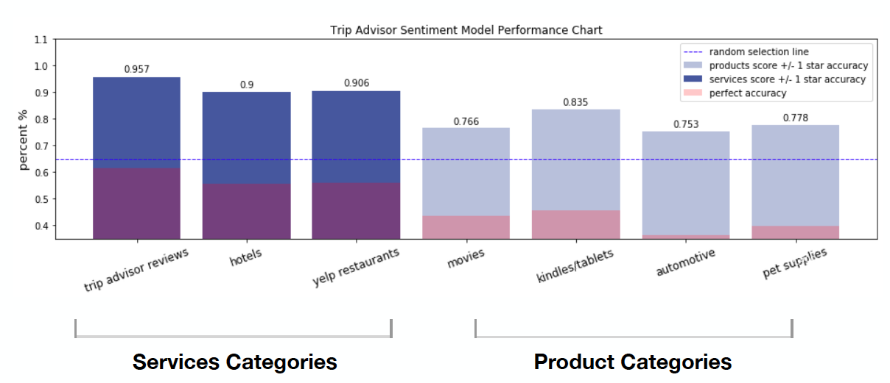
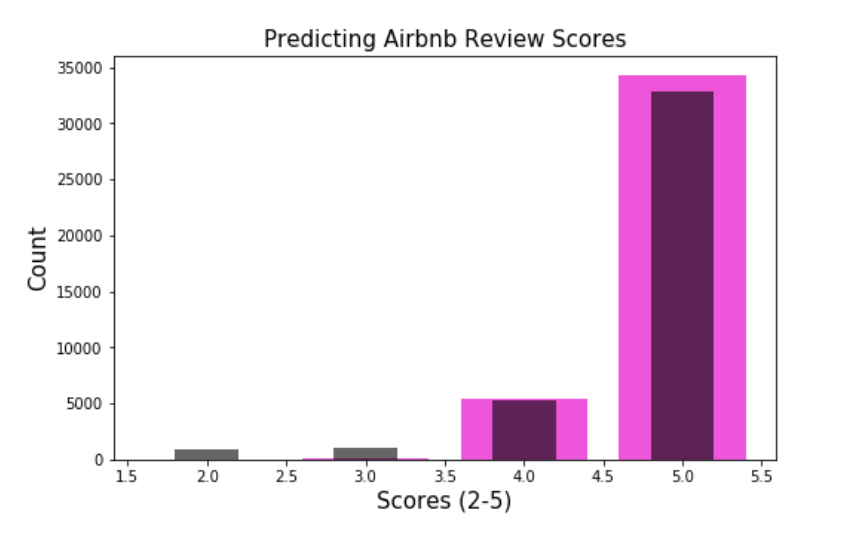

# Sentiment-Prediction-and-a-Study-of-Transferability

### Capstone: Sentiment Prediction and a Study of the Transferability of Text Sentiment Modelling 		    Across Service/Product Categories

### Keywords:
- Transferability: A measure of how well a model performs on different but related datasets
- LSTM: Long Short Term Memory RNN (recurrent neural net). Unlike feedforward neural nets, LSTMs have a recurrent like structure in addition to an LSTM cell, which learns certain sequence relationships and acts as a memory input to the RNN
- Accuracy: Measurement of the total correct predictions over the total predictions made
- +/- 1 Star Accuracy: Measurement of the total correct predictions +/- 1 star over the total predictions made

### Introduction: 
- It’s possible to decouple business growth into four metrics. Customer retention, average selling price, unit sales count, and costs/expenses associated to those sales. 
Understanding customer sentiment via automated text based semantic models allows companies to learn about, build trust with, and assist users, which if managed properly, can drive engagement which consequently increases all four metrics. This is clearly of upmost importance for business incumbents and rapidly scaling businesses alike.

### Primary Question: 
- Can you train a service/product category specific text sentiment classifier and apply it to data beyond the category in question? Is user sentiment “product/service“ agnostic? 
- Null Hypothesis: Yes, a model’s ability to identify sentiment in text is service/product category agnostic.

### How:
- Train an LSTM on 100,000 Trip Advisor Lodging Reviews and their associated star scores
Apply trained model to text based reviews and star scores of a variety of other datasets representing different service/product categories
- Run statistical hypothesis test on results to reject or fail to reject null hypothesis
- Present model with prediction tool and model results

### Results & Conclusion
- Main Model Scores: 			+/- 1 star accuracy: 95%		Accuracy: 61%
- Mean Service Scores: 		+/- 1 star accuracy: 92%		Accuracy: 58%
- Mean Product Scores: 		+/- 1 star accuracy: 79%		Accuracy: 41%
- Hypothesis Test: : 			P-val: 0.0001					Null-Hypothesis: Rejected

### Conclusion: 
- Based on initial testing, it appears that there exists an identifiable mean accuracy difference across datasets, which is most apparent when comparing service category review data to product category reviews.

### Applications: 
- Apply model to non-labeled data to predict reviews: Ex. Airbnb data that doesn’t provide review level scoring. Data Management and Integrity: Predict the probability of noisy data and auto-remove. Identify outlier customer experience. Compare own customer sentiment to competitors. 

### Predicting Airbnb Reviews in Portland:
- When the model is applied to Airbnb reviews sourced from InsideAirbnb, the model performce extremely with approx. 88% accuracy, which is extremely high. This is of course because of how unbalanced the Airbnb reviews' sentiment scores seem to appear. This chart compares the predictions (dark skinny bars) to the reviews' listings' scores and almost perfectly in sentiment distribution. This is an example of how an accurate model can be used to generate new data that is assumed to be close in nature to the real, yet not accessible data. 

